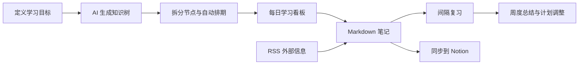
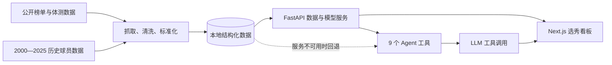

# 王鹏飞

## 工作经历：Java研发工程师

1. 2021-2022 浦东华宇信息技术有限公司
2. 2023-2025 菜鸟网络科技有限公司
3. 2025 酷澎网络科技(上海)有限公司

## 浙高院平台化改造三期-排期子中心、音视频子中心、凤凰智审 

### ◆ 项目描述：

为整合浙高院的各个业务系统，采用阿里提供的HSF和EDAS平台，将全省法院的所有系统部署在一个平台上，集中了用户中心、流程中心、消息中心、案件中心、实体材料中心、排期子中心等十余个应用。既利于法官工作流程的精简，也方便系统的统一管理、维护和日后的扩展。
我在小组主要负责开庭相关业务，包括庭前排期、庭后视频回传等。其中在智慧庭审项目中对接了大连团队开发的客户端软件，实现了多案联审功能。

### ◆ 使用技术：

HSF、SpringBoot、Mybatis-Plus、RocketMQ、Redis、Apache POI、Mysql和PostgreSQL数据库、Freemarker，ckplayer、fetch

### ◆ 责任描述：

1. 编写排期查询模块的前后端所有功能，根据条件查询相应的历史排期数据。对sql数据进行优化使得可以快速进行大数据量的分页查询。使用POI对数据进行导出Excel表格导出功能。
2. 在添加、修改(删除)排期中加入发送(取消)外网会议预订的功能，为使应用解耦和缩短请求响应时间，使用RocketMQ发送预定信息。在添加多案联审时同样添加了预定多案联审会议的功能。
3. 参与了开庭排期页面的增删改查功能的设计与开发，新加入了排期时间冲突提醒功能的开发，对可能存在的数不一致问题进行了优化。
4. 使用Redis作为分布式锁解决方案，解决月末或年末的排期数据混乱的问题。
5. 使用freemarker模板，利用闭庭后回传的大json数据来生成判决书文件等庭审文件。
6. 使用CXF框架，开发webService接口供庭审系统同步数据以及开闭庭数据反馈。
7. 开发视频地址上阿里oss云接口，维护微法院传递过来的视频数据，将微法院的视频数据与排期相关联。并使用ckplayer国产播放器开发国产电脑播放视频页面，附带视频文件下载功能。
8. 开发浙江高院对项目平台的其他新需求，维护排期子中心、音视频子中心和老数字法庭系统中出现的bug。
9. 到法院实地的法庭系统环境和实施工程师进行系统调试，开展发布会的准备工作。

------

## 智能提押提讯辅助系统

该系统将法警业务审批与浙高院平台化应用联系起来，能够提高审批效率，并配合硬件设备，使用指纹，二维码，人脸识别等方式为法警提押犯人提供便利。项目一期主要包括登录注册模块、调警审批模块、调警案件列表展示模块、开庭数据交互模块、与硬件交互的法警提押模块等。

### ◆ 使用技术：

SpringBoot、HSF、Activity、Shiro、Quartz、Redis、vue、Element-UI

### ◆ 责任描述：

1. 使用Shiro和jwt和为后端架构，element-ui为前端组件开发用户登录和权限校验功能，设计RBAC权限为后续的权限扩展提供空间。构建了用户鉴权中心，采用RSA算法代替HASH256进行用户身份校验。
2. 使用Quartz框架，动态注册定时任务，方便在调警案件未在预定时间闭庭时发送短信。
3. 配合同事共同完成调警审批的功能模块，动态注册定时任务来解决提前通知看守所的问题。
4. 配合同事使用监狱的智能设备进行系统的测试。

---

## 杭云建智能建造管理平台

### ◆ 项目描述：

为促进产业转型，该项目旨在提供工程行业内的互联网+智慧建造综合项目管理平台。该项目采用SpringCloud的微服务项目架构，包含项目管理、资金成本计算、物料设备管理、人员管理、进度监控、建设安全监测等多个模块。也可以为实际建设场景提供个性化定制。

### ◆ 使用技术：

SpringBoot, SpringCloud, Mybatis-plus, RabbitMq, Redis, jwt, Thymeleaf、vue

### ◆ 责任描述：

1. 参与项目的需求分析和总体设计，主要负责开发物料设备管理模块并与其它同事协同合作，共同推进项目的落地。
2. 项目采用Gateway网关作为服务的总入口，用Hystrix组件做服务的限流，Ribbon做服务的负载均衡。
3. 热点数据采用Redis缓存存储，搭建Redis的主从集群已实现服务的高可用和高并发。
4. 为防止服务之间的异常调用，使用jwt权限校验及RSA算法，实现各服务之间调用的权限校验功能。
5. 采用RabbitMq延时队列的方案来开发某些预警功能，例如设备使用超期预警，质量安全整改超期预警等。
6. 对于客户定制化开发的物料采购模块，针对常用的物料展示页面使用Thymeleaf进行静态化处理，减轻服务端的访问压力。
7. 负责物料设备管理模块整体功能的开发，包括设备使用的预约、审批，设备的提取、归还，物料库存不足提醒等功能。
8. 配合其他同事完成其余模块的开发以及代码的日常测试、bug修正等工作。

---

## 菜鸟客服工单团队相关项目

### **◆ 项目描述：**

该项目是菜鸟物流核心客服平台升级项目，为了解决原有业务系统因业务不断增长和复杂化增加，带来的性能瓶颈、扩展性差和维护成本高的问题。基于Pandora Boot构建，采用DDD进行业务领域架构，整合了客服工单核心、工单搜索中心、单据中心、路由中心、策略配置中心和赔付中心等核心模块。通过MySQL+OTS的分级存储方案、MetaQ异步解耦和Redis缓存优化，显著提升了系统的吞吐能力、稳定性和开发效率，日均处理百万级工单，有效支撑了消费者、商家和小二等多端业务。

###  **◆ 使用技术：**

HSF、SpringBoot、Mybatis、RocketMQ、Redis、OTS、OpenSearch、

### **◆ 责任描述：**

1. 作为项目核心开发，基于DDD领域驱动设计，完整参与客服工单业务平台升级改造，参与核心模块方案设计与代码落地，对客服核心流程进行梳理和优化
2. 负责小二端工单执行流程重构，针对当前工单状态混乱与执行耗时高并发性差的问题，引入了MQ实现组件执行异步化；基于Redis实行任务幂等控制，并结合分布式锁保障异步消息顺序消费与资源并发安全，优化后工单平均处理时长降低40%
3. 负责工单搜索链路优化，构建新工单搜索服务，采用OTS作为主查询引擎，利用其No-Schema特性灵活存储工单动态数据，采用OTS+MySQL的方式替换老系统OpenSearch搜索的不足，提升数据查询的准确性和响应速度
4. 对接工单商家端与AE货主中心，引入货主中心的数据，使用相应的权限方案，使得货主中心的商家用户能跳转到商家端并正常使用工单系统。编写相关测试文档，添加相应接口预警信息
5. 对客服小二端业务使用痛点进行分析与优化，通过优化交互流程与新增工具组件，提升了小二操作便捷性和效率，提升客服的工作效率
6. 主导了物流工单核心功能“地址修改”组件的设计与优化，与供应链进行交互，保证跨系统的数据一致性
7. 负责系统稳定性建设，对系统关键指标完善监控和告警体系，并梳理制定应急预案，同时负责线上问题的响应排查与优化。设计多级缓存方案增强系统的稳定性。

---

## 保罗项目 - 物流调度平台 

### **◆ 项目描述：**

该项目是菜鸟物流为构建一体化物流服务能力构建的核心调度中台，为了解决上游（上百家ERP服务商）与下游（数十家物流公司）之间系统异构、协议不一致、链路复杂、维护成本高的核心痛点。平台抽象并封装了物流服务的通用功能，提供包含异常包裹实时查询、到达计划时效预测、在途包裹拦截、秒级履约指令下发（秒送达）等核心服务。通过该业务中台，极大的降低了物流上下游业务对接的复杂度

### **◆ 使用技术：**

dataworks，cone低代码平台，SpringBoot、Mybatis-Plus、HSF、RocketMQ、

### **◆ 经历描述：**

1. 负责物流数据运营看板开发与设计，基于DataWorks构建离线数仓，对服务调用日志进行多维度聚合分析，统计每日各服务、各租户的调用量和性能指标
2. 搭建物流调度数据可视化后台，提供多维度查询和报表导出功能，赋能业务团队实时监控业务健康情况；上线后帮助运营辅助决策优化，降低运营成本约25%
3. 参与路由中心优化，深入分析项目一期中静态路由策略的不足与数据链路重复调用问题，在项目二期参与并设计实现了动态路由组件，支持基于实时流量、动态查询履约数据，并支持动态路由与降级

---

# 企业内部薪酬管理平台

### **◆ 项目描述：**

参与企业级薪酬与绩效管理平台建设，面向 HR、管理者及业务负责人，覆盖绩效评估、调薪/奖金模拟、人员资格校验和结果报表等关键管理场景。通过将分散的人员、绩效与薪酬规则进行平台化整合，支持管理者快速完成方案测算、对比与决策，降低人工核算和跨部门沟通成本。项目提供标准化的数据导入、审核确认与结果导出能力，提升大规模人员数据处理的准确性、可追溯性和运营效率。最终帮助企业提高薪酬激励方案的透明度与执行效率，为人才保留、组织管理和成本控制提供数据支撑。

### **◆ 使用技术：**

Spring-boot、Apache POI、Redis、MySql

### **◆ 经历描述：**

1. 参与薪酬计算引擎设计，将奖金、调薪、股票、晋升、总薪酬预测、异常补偿 等核心薪酬域按照计算规则拆分为多阶段计算管线，实现规则隔离、可复用计算和批量员工测算。
2. 设计统一计算上下文模型，保证不同触发路径下以员工为核心的薪酬计算口径一致性和结果可追溯。通过多组参数迭代测算，生成不同假设下的薪酬结果，为 HR 薪酬预算和调薪策略提供决策支持。
3. 针对薪酬 review 批处理场景，对计算结果进行类型拆分和批量分片写入，减少数据库往返次数，提升大批量员工计算的落库吞吐。
4. 负责列表查询性能优化。通过条件聚合完成 EAV 长表行转列，采用“先过滤、先聚合、后关联”方式控制 JOIN 基数，并结合复合索引与执行计划分析，将十万级数据场景下接口 RT 从数十秒降低至 1 秒以内。
5. 设计并实现薪酬评审 Excel 上传处理链路。基于 Apache POI 对通用 Pipeline 抽象复用，实现多角色下的不同导出内容和样式需求。采用模板方法与策略模式思想**，将 Excel 上传流程抽象为多个可插拔组件，便于扩展和维护。
6. 实现上传变更的行列级差异预览和二阶段确认机制，降低

# 黑客松竞赛项目：

| 项目                | 关注的问题                                           | 核心形态                                     | 代表性能力                                                  |
| ------------------- | ---------------------------------------------------- | -------------------------------------------- | ----------------------------------------------------------- |
| LearnFlow           | 如何在信息过载中建立并持续执行一条学习主线           | AI 学习规划与复习工作流                      | 知识树、自动排期、Markdown 笔记、间隔复习、RSS、Notion 同步 |
| AWS NBA Draft Agent | 如何让复杂的选秀数据变得可查询、可比较、可解释       | 数据管道 + FastAPI + Next.js 看板 + AI Agent | 9 个 Agent 工具、历史球员 kNN 匹配、双模式预测、服务降级    |
| MBTI Assistant      | 如何把模糊的人格标签转化为可回顾的行为记录与成长行动 | 本地优先 Electron 桌面助手                   | 行为片段、非诊断性分析、聚合画像、微行动计划、安全 IPC      |

## LearnFlow

一个 AI 驱动、以知识树为主线的个人学习规划与复习工作流，帮助学习者把“想学一个领域”转化为可安排、可记录、可复习的长期行动。

### 项目要解决的问题

学习新领域时，真正困难的通常不是找到资料，而是判断应该先学什么、如何拆分、每天做什么，以及如何让笔记和复习持续发生。

现有工具往往只解决其中一段：任务工具缺少知识结构，笔记工具缺少计划，RSS 阅读器让信息继续增加，AI 对话又容易停留在一次性建议。结果是资料越来越多，学习主线却越来越模糊。

LearnFlow 希望把这些分散环节串成一个闭环：

### 构建了什么

1. 从学习目标生成知识树

   用户可以输入领域、目标、范围、行业和每日可投入时间，由 AI 生成多层级学习路线。生成结果不是不可编辑的答案，而是可以继续增删、改名、拖动和调整状态的知识树。

​	当叶子节点的预估时长超过每日学习上限时，系统可以将其拆成更小的执行单元，避免计划看起来完整、实际却无法开始。

2. 基于容量的自动排期

   系统按照知识树的 DFS 顺序提取叶子节点，根据开始日期、每日可用时长和周末策略分配学习日期。用户既可以重排整个领域，也可以从当前选中的节点开始局部重排，已经完成或被保留的计划不会被简单覆盖。

   这让知识树从“目录”变成真正可执行的时间安排。

3. 节点化 Markdown 笔记

   每个知识节点都有对应的 Markdown 笔记，支持编辑与实时预览。AI 可以对笔记做逻辑纠错、结构整理和知识衍生，用户通过前后对比决定是否采纳，而不是让模型直接覆盖原内容。

   父节点还可以聚合展示直接子节点的标题和状态，使笔记与学习结构保持关联。

4. 每日看板与间隔复习

   每日看板聚合当天学习任务、待复习节点与逾期任务，并展示完成数、学习时长、连续学习和活跃领域等信息。系统内置基于艾宾浩斯遗忘曲线的复习节奏，也支持自定义复习模板，并提供今日、列表和月历三种查看方式。

5. RSS 订阅与检索

   RSS 已经不是“未来功能”。当前代码支持添加 RSS/Atom 源、抓取和解析文章、展示条目并在阅读器中检索。服务端会优先直接请求订阅源，请求失败时使用代理回退。

   目前 RSS 更接近“学习资料入口”，与知识节点的自动推荐和双向关联仍是后续可以加强的方向。

6. Notion 同步

   Notion 同步也已有实际实现。用户配置 Integration Token 后，可以把选中的知识节点及 Markdown 笔记单向导出到 Notion。系统能够自动创建 LearnFlow 数据库，写入领域、层级、预计时长、状态和开始日期，并把标题、列表、引用、代码块等 Markdown 内容转换为 Notion Blocks；长笔记会分批追加，避开单次块数量限制。

   需要准确说明的是：当前代码的核心能力是“本地到 Notion 的单向同步/导出”。稳定的页面映射、去重更新和真正的双向增量同步仍适合作为下一阶段能力，不应在网站上过度描述。

## NBA Draft Agent

**一个面向 NBA 选秀场景的 AI 球探与数据分析系统。它把 2026 届新秀数据、历史体测数据、机器学习预测和自然语言问答整合在同一套产品中。**

### 项目要解决的问题

NBA 选秀判断不是简单地查看一张模拟榜单。球探和分析者需要同时处理新秀体测、位置、学校、模拟顺位、历史球员、职业结果等不同来源的信息，并不断在“这个球员现在排在哪里”“他的身体模板像谁”“哪些指标真正影响顺位”之间切换。

传统的信息浏览方式存在三个明显问题：

1. 数据分散在榜单、体测表格和历史资料中，字段与命名方式并不统一。
2. 单一排名只给出结论，难以解释球员为什么处于某个顺位，以及他与历史球员的差异。
3. 即使数据已经整理成表格，普通用户仍然需要熟悉字段和筛选方式，才能回答具体的球探问题。

因此，这个项目希望构建一套从数据采集、结构化处理、模型分析到自然语言交互的完整链路，让用户既能浏览选秀看板，也能直接向 Agent 提问并获得有数据依据的回答。

### 构建了什么

项目由四个相互配合的部分组成：

1. **数据处理管道**：抓取和整理 2026 届模拟选秀与联合试训数据，对球员姓名、单位、缺失值和重复记录进行标准化，并与 2000—2025 年历史体测及选秀结果进行关联。
2. **FastAPI 数据与模型服务**：对外提供模拟选秀、球员详情、里程碑问题、历史相似球员、体测榜单、球员原型和生涯概率等接口。
3. **Next.js 可视化看板**：展示首轮 Mock Draft、球员详情、预测问题和 Agent 对话，使结构化浏览与自然语言查询可以在同一界面中完成。
4. **工具调用型 AI Agent**：接入 OpenAI 兼容的模型接口，由模型根据问题自主选择工具、读取结构化结果，再组织成面向用户的回答。

## MBTI Assistant

**一个本地优先的 Electron 桌面助手，用具体行为片段代替对他人的简单“贴标签”，并把观察结果转化为温和、可执行的个人成长微行动。**

### 项目要解决的问题

大多数 MBTI 产品停留在问卷、类型结果和人格描述。它们能提供一种自我理解的语言，却很少帮助用户回答更实际的问题：我为什么会形成这个判断？我观察到的是一个稳定倾向，还是单一场景下的偶然行为？如果我欣赏某个人的某种特质，今天能做什么来靠近它？

与此同时，涉及自己和身边人的行为记录具有很强的隐私属性。如果所有原始记录都默认上传到云端，用户很难建立长期信任。

MBTI Assistant 因此把重点从“测出一个类型”转向三个更具体的动作：记录、反思和行动。

### 构建了什么

1. 个人 MBTI 画像与自然语言自评

   用户可以通过四个维度控件记录自己的 MBTI，也可以写一段关于生活、工作或待人方式的描述，主动触发 LLM 分析。结果会给出类型建议、置信度、各维度依据、摘要与限制说明，是否采纳仍由用户决定。

   桌面悬浮徽章会根据当前类型生成对应的艺术字形，让个人状态以轻量方式常驻桌面。

2. 人物名录与行为片段

   用户可以为朋友、同事、客户或其他观察对象建立本地档案，并持续记录多个行为片段。每条记录包含原始描述、发生场景、分类和时间，而不是只保存一个最终 MBTI 标签。

   这种数据结构让结论能够回到具体证据，也允许用户随着新观察更新判断。

3. 单条分析与整体评估

   用户可以选择对单条行为片段进行非诊断性倾向分析，得到可能的维度信号、标签和简要解释；当记录积累后，也可以聚合多条观察生成整体画像。

   分析只在用户显式点击时发生，模型被要求输出结构化 JSON，并在提示中明确“MBTI 不是诊断”。

4. 从欣赏的特质到微行动

   用户可以从分析结果中选择自己欣赏的特质，让助手生成一个当天可以完成的小任务和若干行动步骤。产品因此没有止步于“这个人像哪种类型”，而是把观察转化为自我成长练习。

5. 桌面悬浮窗与系统托盘

   应用包含无边框、置顶的桌面小窗，并支持系统托盘常驻。用户可以快速打开个人画像、观察记录或 LLM 配置测试，而不需要保持一个完整应用窗口一直占据屏幕。